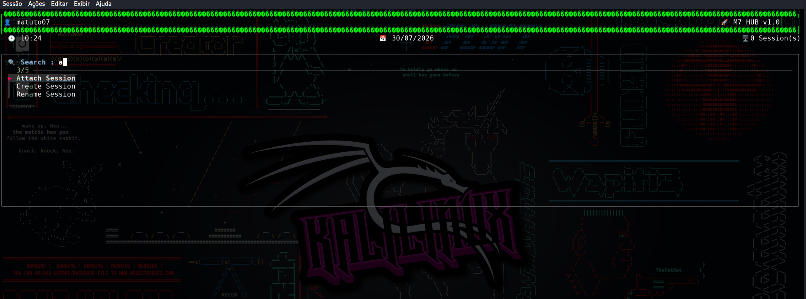
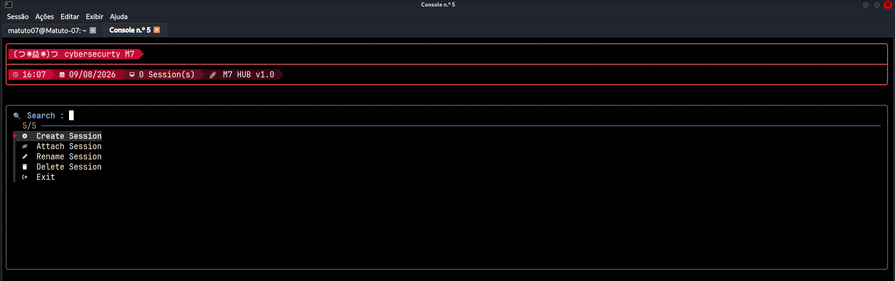
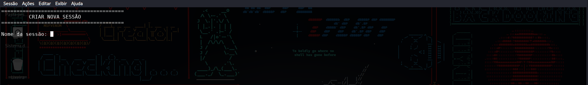
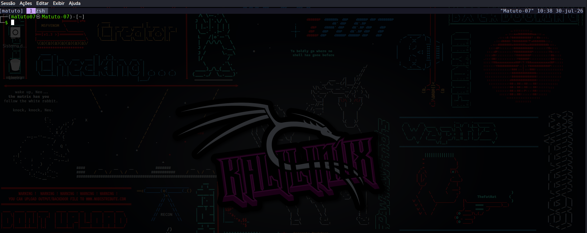
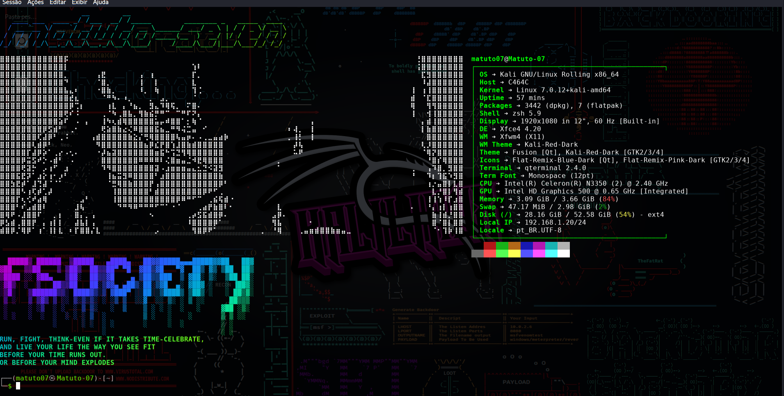
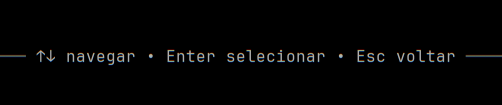
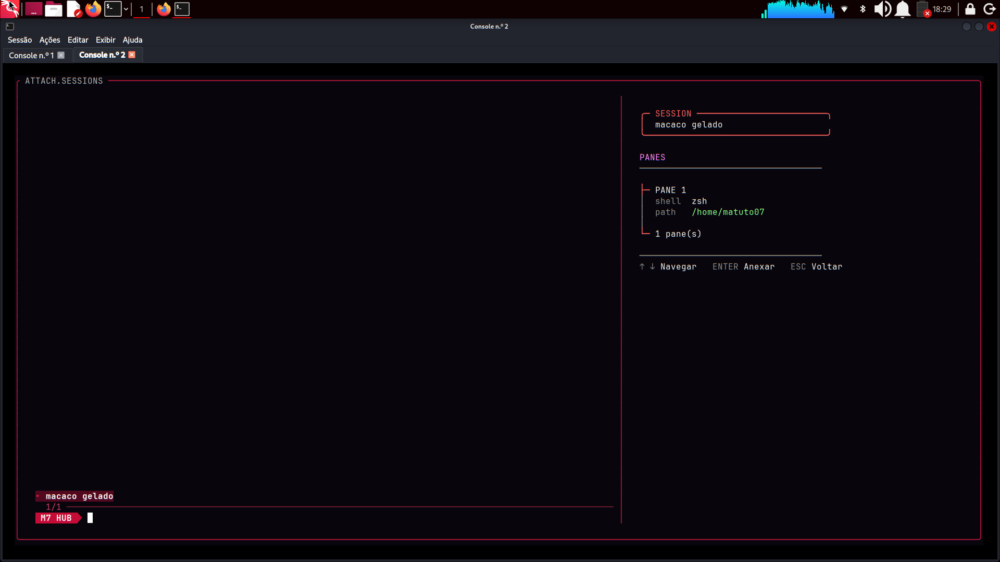

# 👾 M7 HUB

[](https://www.zsh.org/)
[](https://www.kali.org/)
[](https://github.com/tmux/tmux)
[]()

> *"Se vou usar tmux como túnel pro terminal, não vou usar cru feito todo mundo."*

Um hub pessoal de gerenciamento de sessões `tmux`, construído em Zsh. Sobe sozinho assim que o terminal abre, te dá controle total das sessões por um menu interativo, sem precisar decorar comando nenhum.

Feito 100% pra uso próprio, do meu jeito. Ainda em sprint diário — o que você vê aqui é o estado atual, não a versão final.

---

## 𝕺 𝖖𝖚𝖊 é 𝖎𝖘𝖘𝖔

Peguei a ideia clássica de tmux como túnel pro terminal principal e não me contentei em usar do jeito básico. Construí uma camada de controle por cima: um menu que aparece automaticamente, onde eu crio, anexo, renomeio e deleto sessões sem sair do fluxo visual.

<p align="center">
  
</p>

<p align="center"><i>Menu principal — navegação via <code>fzf</code>, com header dinâmico mostrando usuário, hora, data e sessões ativas em tempo real.</i></p>

---

## 👾 𝕮𝖔𝖒𝖔 𝖋𝖚𝖓𝖈𝖎𝖔𝖓𝖆 𝖓𝖆 𝖕𝖗á𝖙𝖎𝖈𝖆

### Header powerline

<p align="center">
  
</p>

O header usa um degradê real de cores (claro → escuro) unindo usuário, hora, data, sessões e versão numa única barra powerline, com cantos arredondados e ícones monocromáticos no menu.

### Criando uma sessão

<p align="center">
  
</p>

Escolhendo **Create Session** no menu, você cai numa tela simples pra nomear a sessão nova. Se deixar em branco, ele usa o nome da pasta atual como padrão.

### Abertura com identidade

<p align="center">
  
</p>

Sempre que você entra num shell de trabalho (depois de criar/anexar uma sessão), o hub dispara um banner de abertura com `figlet` + `lolcat` + `fastfetch` — informações do sistema, tema visual, tudo junto.

### Voltando ao fluxo

<p align="center">
  
</p>

Depois do banner, você cai num shell normal pra trabalhar. Ao sair dele (`exit`), o controle volta automaticamente pro menu do hub — sem precisar reabrir nada, sem perder o fluxo.

### Cancelamento com `Esc`

As ações que abrem uma tela secundária também respeitam o mesmo fluxo de navegação do menu: `Esc` cancela a operação e retorna diretamente ao HUB, sem obrigar o usuário a concluir a ação.

<p align="center">
  
</p>

<p align="center"><i>Atalhos de navegação — <code>Esc</code> cancela e volta ao HUB.</i></p>

Isso vale para **Create Session** e **Attach Session**, mantendo o comportamento coerente entre o menu principal e suas telas internas.

---

## 👾 𝖁𝖎𝖘ã𝖔 𝖉𝖔 𝕻𝖗𝖔𝖉𝖚𝖙𝖔 (𝕻𝕽𝕯)

### Problema
Trabalhar com múltiplas sessões `tmux` exige decorar sintaxe de comando (`tmux new -s`, `tmux attach -t`, `tmux rename-session`, etc). Isso cria fricção no dia a dia de quem abre e fecha terminais o tempo todo, e não escala bem quando o número de sessões ativas cresce.

### Objetivo
Eliminar essa fricção com uma camada de controle visual sobre o `tmux`, que:
- Apareça automaticamente ao abrir o terminal, sem exigir comando manual
- Permita executar as operações mais comuns (criar, anexar, renomear, deletar) via seleção, não digitação
- Mantenha o usuário informado do estado atual (quantas sessões ativas, hora, data) sem precisar consultar `tmux ls`
- Devolva o controle ao próprio hub depois de cada operação, mantendo o fluxo contínuo

### Público-alvo
Uso pessoal — desenvolvido para o próprio fluxo de trabalho do autor, sem intenção inicial de distribuição. Prioriza personalização e liberdade de decisão de design em vez de generalização para terceiros.

### Requisitos funcionais
| ID | Requisito |
|----|-----------|
| RF01 | O hub deve subir automaticamente em todo shell interativo, exceto dentro de uma sessão `tmux` já ativa |
| RF02 | O usuário deve conseguir criar uma sessão nomeada, com fallback para o nome da pasta atual |
| RF03 | O usuário deve conseguir anexar a uma sessão existente via seleção em lista |
| RF04 | O usuário deve conseguir renomear uma sessão existente, com validação de nome duplicado |
| RF05 | O usuário deve conseguir deletar uma sessão, com confirmação explícita antes da ação |
| RF06 | O menu deve exibir contagem de sessões ativas, atualizada a cada abertura |
| RF07 | O menu deve suportar atualização manual (refresh) sem fechar e reabrir |

### Requisitos não funcionais
| ID | Requisito |
|----|-----------|
| RNF01 | A lógica do hub deve viver fora do `.zshrc`, isolada em arquivo próprio |
| RNF02 | O layout deve se adaptar dinamicamente à largura do terminal |
| RNF03 | Cores e identidade visual devem ser configuráveis via tema externo |
| RNF04 | Nenhuma ação destrutiva (deletar sessão) deve ocorrer sem confirmação do usuário |

---

## 👾 𝕾𝖔𝖇 𝖔 𝖈𝖆𝖕ô

Cada função do `m7hub.zsh` cobre uma responsabilidade específica. Aqui está o que cada uma faz, com o trecho de código correspondente.

### `show_banner` — identidade visual de abertura

Dispara o banner com `figlet` + `lolcat` + `fastfetch` toda vez que um shell de trabalho é aberto.

```bash
show_banner() {
    clear
    figlet -f slant "matuto-seven" | lolcat
    fastfetch -c ~/.config/fastfetch/config.json
    figlet -f Bloody "fsociety" | lolcat
    echo -e "\e[1;31mRUN, FIGHT, THINK-EVEN IF IT TAKES TIME-CELEBRATE,\nAND LIVE YOUR LIFE THE WAY YOU SEE FIT\nBEFORE YOUR TIME RUNS OUT.\nOR BEFORE YOUR MIND EXPLODES\e[0m" | lolcat
    echo ""
}
```

### `create_session` — criação de sessão

Abre uma entrada de nome com edição manual de cursor, aceita `Enter` para confirmar e `Esc` para cancelar. Se o nome ficar vazio, usa o nome da pasta atual como fallback e bloqueia sessões duplicadas.

```bash
create_session() {

    clear

    echo "========================================"
    echo "         CRIAR NOVA SESSÃO"
    echo "========================================"
    echo

    local name=""
    local key
    local seq
    local cursor=0

    printf "Nome da sessão: "

    while true; do
        read -sk 1 key

        case "$key" in
            $'\e')
                # ESC sozinho = cancelar.
                # ESC [ C/D = setas direita/esquerda.
                read -sk 1 -t 0.05 seq || {
                    echo
                    return 2
                }

                if [[ "$seq" == "[" ]]; then
                    read -sk 1 -t 0.05 seq || continue

                    case "$seq" in
                        C)  # seta direita
                            (( cursor < ${#name} )) && (( cursor++ ))
                            ;;
                        D)  # seta esquerda
                            (( cursor > 0 )) && (( cursor-- ))
                            ;;
                        H)  # Home
                            cursor=0
                            ;;
                        F)  # End
                            cursor=${#name}
                            ;;
                        *)
                            ;;
                    esac

                    # Redesenha a linha e reposiciona o cursor.
                    printf "\rNome da sessão: %s\033[K" "$name"
                    if (( cursor < ${#name} )); then
                        printf "\033[%dD" $(( ${#name} - cursor ))
                    fi
                else
                    # ESC não seguido de uma sequência de seta = cancelar.
                    echo
                    return 2
                fi
                ;;

            $'\n'|$'\r')
                echo
                break
                ;;

            $'\x7f'|$'\x08')
                # Backspace: remove o caractere à esquerda do cursor.
                if (( cursor > 0 )); then
                    if (( cursor == ${#name} )); then
                        name="${name[1,$((cursor-1))]}"
                    else
                        name="${name[1,$((cursor-1))]}${name[$((cursor+1)),-1]}"
                    fi

                    (( cursor-- ))

                    printf "\rNome da sessão: %s\033[K" "$name"
                    if (( cursor < ${#name} )); then
                        printf "\033[%dD" $(( ${#name} - cursor ))
                    fi
                fi
                ;;

            *)
                # Insere o caractere na posição atual do cursor.
                if (( cursor == 0 )); then
                    name="$key$name"
                elif (( cursor >= ${#name} )); then
                    name="$name$key"
                else
                    name="${name[1,$cursor]}$key${name[$((cursor+1)),-1]}"
                fi

                (( cursor++ ))

                printf "\rNome da sessão: %s\033[K" "$name"
                if (( cursor < ${#name} )); then
                    printf "\033[%dD" $(( ${#name} - cursor ))
                fi
                ;;
        esac
    done

    [[ -z "$name" ]] && name="${PWD##*/}"

    if command tmux has-session -t "$name" 2>/dev/null; then
        echo
        echo "[ERRO] Já existe uma sessão chamada '$name'."
        echo
        read "?Pressione Enter para voltar..."
        return 2
    fi

    command tmux new-session -s "$name"

}
```

### `attach_session` — seleção, preview e anexação

Lista as sessões com `tmux list-sessions`, usa `fzf` como interface de seleção e mostra um preview lateral em tempo real. O preview apresenta a sessão selecionada, cada pane, shell, diretório atual e quantidade de panes. `↑`/`↓` navegam, `Enter` anexa e `Esc` cancela e retorna ao HUB.

```bash
attach_session() {

    local session
    local fzf_status

    session=$(command tmux list-sessions -F "#{session_name}" 2>/dev/null | \
        fzf \
            --bind='esc:abort' \
            --prompt=$'\e[38;2;255;255;255m\e[48;2;197;12;54m M7 HUB \e[38;2;197;12;54m\e[48;2;8;6;12m\e[0m ' \
            --pointer='▸' \
            --marker='●' \
            --separator='─' \
            --scrollbar='│' \
            --gutter='│' \
            --border='rounded' \
            --border-label=' ATTACH.SESSIONS ' \
            --border-label-pos='2' \
            --padding='1,2' \
            --margin='1,2' \
            --no-multi \
            --preview='
                selected={}

                # M7 HUB preview — POSIX shell only.
                # Sem janelas: mostramos apenas a sessão e seus panes.
                RED="\033[38;5;203m"
                MAGENTA="\033[38;5;213m"
                WHITE="\033[38;5;255m"
                DIM="\033[38;5;245m"
                GREEN="\033[38;5;120m"
                RESET="\033[0m"

                printf "\n"
                printf "${RED}  ╭─ SESSION ─────────────────────────╮${RESET}\n"
                printf "${RED}  │${RESET}  ${WHITE}%s${RESET}\n" "$selected"
                printf "${RED}  ╰───────────────────────────────────╯${RESET}\n\n"

                printf "${MAGENTA}  PANES${RESET}\n"
                printf "${DIM}  ───────────────────────────────────${RESET}\n\n"

                count=0
                panes=$(command tmux list-panes -t "$selected" -F "#{pane_index}|#{pane_current_command}|#{pane_current_path}" 2>/dev/null)

                if [ -n "$panes" ]; then
                    while IFS="|" read -r pane_index pane_command pane_path; do
                        printf "${RED}  ├─${RESET} ${WHITE}PANE %s${RESET}\n" "$pane_index"
                        printf "${DIM}  │  shell${RESET}  ${WHITE}%s${RESET}\n" "$pane_command"
                        printf "${DIM}  │  path${RESET}   ${GREEN}%s${RESET}\n" "$pane_path"
                        printf "${DIM}  │${RESET}\n"
                        count=$((count + 1))
                    done <<EOF
$panes
EOF
                else
                    printf "${DIM}  │  Nenhum pane disponível.${RESET}\n"
                    printf "${DIM}  │${RESET}\n"
                fi

                printf "${RED}  └─${RESET} ${WHITE}%d pane(s)${RESET}\n" "$count"
                printf "\n"
                printf "${DIM}  ───────────────────────────────────${RESET}\n"
                printf "${DIM}  ↑ ↓${RESET} ${WHITE}Navegar${RESET}   ${DIM}ENTER${RESET} ${WHITE}Anexar${RESET}   ${DIM}ESC${RESET} ${WHITE}Voltar${RESET}\n"
                printf "\n"
            ' \
            --preview-window='right:38%:wrap:border-left' \
            --color='fg:#d8dee9,bg:#08060c,hl:#ff8fa8,fg+:#ffffff,bg+:#52091f,hl+:#ff7b9b,pointer:#ff1744,marker:#ff4d6d,spinner:#ff6b8a,border:#b5163d,info:#d13a67,prompt:#ffffff,header:#ff6b8a,gutter:#4d1b2d,separator:#6f1a31,scrollbar:#ff315f')

    fzf_status=$?

    [[ $fzf_status -ne 0 || -z "$session" ]] && return 2

    command tmux attach-session -t "$session"

}
```

### `attach_session` — seleção, preview e anexação

<p align="center">
  
</p>

<p align="center"><i>Attach Sessions com preview lateral da sessão, panes, shell, caminho atual e atalhos de navegação.</i></p>

### `rename_session` — renomeação com validação

Seleciona uma sessão via `fzf`, pede o novo nome e impede a criação de um nome já utilizado.

```bash
rename_session() {

    clear

    local old_name
    local new_name

    old_name=$(command tmux list-sessions -F "#{session_name}" 2>/dev/null | fzf --prompt="Sessão > ")

    [[ -z "$old_name" ]] && return

    echo
    read "?Novo nome: " new_name

    [[ -z "$new_name" ]] && return

    if command tmux has-session -t "$new_name" 2>/dev/null; then
        echo
        echo "[ERRO] Já existe uma sessão com esse nome."
        read "?Pressione Enter para voltar..."
        return
    fi

    command tmux rename-session -t "$old_name" "$new_name"

}
```

### `delete_session` — remoção com confirmação

Seleciona a sessão via `fzf` e exige confirmação explícita antes de executar `tmux kill-session`.

```bash
delete_session() {

    clear

    local session
    local confirm

    session=$(command tmux list-sessions -F "#{session_name}" 2>/dev/null | \
        fzf --prompt="Excluir sessão > ")

    [[ -z "$session" ]] && return

    echo
    read "?Excluir '$session'? [s/N]: " confirm

    case "$confirm" in
        s|S|y|Y)

            command tmux kill-session -t "$session"

            echo
            echo "[OK] Sessão removida."

            sleep 1
            ;;

        *)

            echo
            echo "Operação cancelada."

            sleep 1
            ;;

    esac

}
```

### `matuto_hub` — renderização do menu

Monta o cabeçalho dinâmico com hora, data, quantidade de sessões e versão, usando segmentos em degradê com setas powerline. O menu principal usa ícones Nerd Font, `fzf`, navegação por teclado e `F5` para refresh.

```bash
matuto_hub() {

    clear

    local WIDTH=$(tput cols)

    # calcula a largura visual real de uma string,
    # compensando emojis que ocupam 2 colunas na tela
    # mas contam como 1 caractere pro shell
    local -A M7_WIDE_CHARS=(
        "👤" 1 "🚀" 1
    )
    vwidth() {
        local str="$1"
        local extra=0
        local ch
        for ch in "${(@k)M7_WIDE_CHARS}"; do
            local tmp="$str"
            while [[ "$tmp" == *"$ch"* ]]; do
                extra=$((extra + 1))
                tmp="${tmp/$ch/}"
            done
        done
        echo $(( ${#str} + extra ))
    }

    local DATE=$(date '+%d/%m/%Y')
    local TIME=$(date '+%H:%M')
    local SESSIONS=$(command tmux ls 2>/dev/null | wc -l | tr -d ' ')
    [[ "$SESSIONS" -eq 0 ]] && SESSIONS="0"

    # degradê real: hora (claro) → data → sessões → versão (escuro)
    local INFO="(つ◉益◉)つ cybersecurty M7"
    local VERSION="🚀 M7 HUB v1.0"
    local POWER_ARROW=$'\ue0b0'
    local TIME_BG=$'\e[48;2;197;12;54m'
    local DATE_BG=$'\e[48;2;154;5;38m'
    local SESS_BG=$'\e[48;2;103;15;34m'
    local VERSION_BG=$'\e[48;2;60;8;20m'
    local TIME_FG=$'\e[38;2;197;12;54m'
    local DATE_FG=$'\e[38;2;154;5;38m'
    local SESS_FG=$'\e[38;2;103;15;34m'
    local VERSION_FG=$'\e[38;2;60;8;20m'

    printf "${RED}╭%s╮${R}\n" "$(printf '─%.0s' $(seq 1 $((WIDTH-2))))"

    # o "chip" do usuário usa o mesmo vermelho claro da hora
    printf "${RED}│${R}${TIME_BG}${CHIP_FG} %s ${R}${TIME_FG}%s${R}" "$INFO" "$POWER_ARROW"
    printf "\e[%dG${RED}│${R}\n" "$WIDTH"

    printf "${RED}├%s┤${R}\n" "$(printf '─%.0s' $(seq 1 $((WIDTH-2))))"

    printf "${RED}│${R}"
    local ICON_TIME=$'\uf017'
    local ICON_DATE=$'\uf073'
    local ICON_SESS=$'\uf108'

    printf "${TIME_BG}${CHIP_FG} ${ICON_TIME} %s " "$TIME"
    printf "${TIME_FG}${DATE_BG}${POWER_ARROW}${R}"
    printf "${DATE_BG}${CHIP_FG} ${ICON_DATE} %s " "$DATE"
    printf "${DATE_FG}${SESS_BG}${POWER_ARROW}${R}"
    printf "${SESS_BG}${CHIP_FG} ${ICON_SESS} %s Session(s) " "$SESSIONS"
    printf "${SESS_FG}${VERSION_BG}${POWER_ARROW}${R}"
    printf "${VERSION_BG}${CHIP_FG} %s " "$VERSION"
    printf "${R}${VERSION_FG}%s${R}" "$POWER_ARROW"
    printf "\e[%dG${RED}│${R}\n" "$WIDTH"

    printf "${RED}╰%s╯${R}\n\n" "$(printf '─%.0s' $(seq 1 $((WIDTH-2))))"

    local ICON_CREATE=$'\uf055'
    local ICON_ATTACH=$'\uf0c1'
    local ICON_RENAME=$'\uf040'
    local ICON_DELETE=$'\uf1f8'
    local ICON_EXIT=$'\uf08b'

    RESULT=$(
    printf "%s\n" \
    "${ICON_CREATE}  Create Session" \
    "${ICON_ATTACH}  Attach Session" \
    "${ICON_RENAME}  Rename Session" \
    "${ICON_DELETE}  Delete Session" \
    "${ICON_EXIT}  Exit" | fzf \
        --height=40% \
        --layout=reverse \
        --border=rounded \
        --cycle \
        --pointer="▶" \
        --marker="✓" \
        --prompt="🔍 Search : " \
        --border-label=" ↑↓ navegar • Enter selecionar • Esc voltar " \
        --border-label-pos=bottom \
        --expect=f5
)
    KEY=$(head -n1 <<< "$RESULT")
    typeset -g M7_REPLY=$(tail -n1 <<< "$RESULT")

    if [[ "$KEY" == "f5" ]]; then
        return 2
    fi

    [[ -z "$M7_REPLY" ]] && return

    return
}
```

### `matuto_start` — o loop de controle

O coração do HUB: verifica se já está dentro do `tmux`, checa dependências, mantém o menu em loop e direciona cada escolha para a função correspondente. Depois de criar/anexar uma sessão, abre o shell de trabalho e retorna ao HUB quando esse shell termina.

```bash
matuto_start() {

[[ -n "$TMUX" ]] && return

    check_deps

    while true; do

        matuto_hub

        if [[ $? -eq 2 ]]; then
            continue

        fi

        case "$M7_REPLY" in

            $'\uf055''  Create Session')
                create_session
                [[ $? -eq 2 ]] && continue
                ;;

            $'\uf0c1''  Attach Session')
                attach_session
                [[ $? -eq 2 ]] && continue
                ;;

            $'\uf040''  Rename Session')
                rename_session
                continue
                ;;

            $'\uf1f8''  Delete Session')
                delete_session
                continue
                ;;

            $'\uf08b''  Exit')
                exit
                ;;

            *)
                continue
                ;;

         esac

        export MATUTO_SHELL=1

        show_banner

        zsh

        unset MATUTO_SHELL

    done
}
```

---

## 👾 𝕯𝖎á𝖗𝖎𝖔 𝖉𝖊 𝖇𝖔𝖗𝖉𝖔

Esse projeto é atualizado com frequência — o registro abaixo acompanha a evolução real, não só o resultado final.

| Data | O que mudou |
|------|-------------|
| 29/07/2026 | Primeira versão funcional: menu, CRUD de sessões, banner de abertura |
| 30/07/2026 | Separação da lógica do hub para fora do `.zshrc`, isolada em `m7hub.zsh` |
| 30/07/2026 | Correção de escopo de variável (`REPLY` → `M7_REPLY`) para evitar conflito com `read` |
| 30/07/2026 | Revisão de arquitetura: identificado e revertido uso de `exec zsh` que quebrava o retorno automático ao menu |
| 01/08/2026 | Sprint: checagem automática de dependências (`check_deps`) e parsing de sessão mais robusto (`tmux list-sessions -F`) |
| 02/08/2026 | Sprint: sistema de temas (`red`, `matrix`, `blood`) e correção completa da moldura do header — bug do `tr` com UTF-8, borda fechada embaixo, e alinhamento robusto via posicionamento absoluto de cursor |
| 08/08/2026 | Sprint: chip powerline no header (nome de usuário com fundo colorido, degradê de blocos `▓▒░` e seta powerline fechando a transição pro fundo padrão) |
| 09/08/2026 | Sprint: redesign completo do header — degradê real de cores (claro → escuro) unindo usuário, hora, data, sessões e versão numa barra powerline só; cantos arredondados; ícones monocromáticos (Nerd Font) no menu e nos campos do header, substituindo os emojis |
| 09/08/2026 | Sprint: cancelamento consistente com `Esc` — `Create Session` e `Attach Session` agora permitem cancelar a operação e retornar diretamente ao HUB, mantendo o fluxo de navegação coerente |
| 11/08/2026 | Sprint: redesign do `Attach Session` com preview lateral em tempo real, informações de panes/shell/path, atalhos `↑ ↓`/`Enter`/`Esc` e acabamento visual da interface |
| 13/08/2026 | Sprint: modularização da arquitetura — separação do M7 HUB em módulos de `core`, `tmux` e `ui`, com `m7hub.zsh` mantido como loader central e preservação do comportamento existente |

> Esse quadro vai crescendo junto com o projeto — cada sprint novo entra aqui.

---

## 👾 𝕱𝖚𝖓𝖈𝖎𝖔𝖓𝖆𝖑𝖎𝖉𝖆𝖉𝖊𝖘

- **Menu interativo** via `fzf`, com busca, navegação por teclado e refresh dedicado (`F5`) sem precisar fechar e reabrir
- **Header dinâmico**: usuário, hora, data e contagem de sessões ativas, recalculado toda vez que o menu abre
- **Layout responsivo**: se adapta à largura do terminal em tempo real (`tput cols`)
- **CRUD completo de sessões tmux**: criar, anexar, renomear, deletar — com confirmação antes de deletar
- **Sistema de temas**: cores carregadas de um arquivo de configuração separado
- **Loop de controle**: sai de uma sessão → volta pro hub automaticamente, sem interrupção do fluxo
- **Arquitetura modular**: loader central separado de módulos de `core`, gerenciamento `tmux` e interface `ui`
- **Cancelamento por `Esc`**: operações de criação e anexação podem ser canceladas e retornam diretamente ao HUB
- **Preview de sessões**: `Attach Session` mostra panes, shell e diretório atual em um painel lateral
- **Atalhos no Attach**: `↑`/`↓` navegam, `Enter` anexa e `Esc` volta ao HUB

---

## 👾 𝕬𝖗𝖖𝖚𝖎𝖙𝖊𝖙𝖚𝖗𝖆

O hub vive isolado do `.zshrc`. O `m7hub.zsh` funciona como loader central e carrega os módulos por responsabilidade, mantendo a configuração do terminal limpa e a aplicação organizada:

```
~/.config/m7hb/
├── m7hub.zsh          # loader central
├── config             # variáveis de configuração (tema ativo, etc)
├── core/
│   ├── deps.zsh       # dependências
│   └── start.zsh      # loop de inicialização
├── tmux/
│   └── sessions.zsh   # criação, renomeação e remoção de sessões
├── ui/
│   ├── attach.zsh     # Attach Sessions + preview
│   ├── banner.zsh     # banner de abertura
│   └── menu.zsh       # menu principal
└── themes/
    └── *.conf         # arquivos de cor por tema
```

No `.zshrc`, fica só isso:

```bash
[[ -f "$HOME/.config/m7hb/config" ]] && \
    source "$HOME/.config/m7hb/config"

[[ -f "$HOME/.config/m7hb/themes/${M7_THEME}.conf" ]] && \
    source "$HOME/.config/m7hb/themes/${M7_THEME}.conf"

[[ -f "$HOME/.config/m7hb/m7hub.zsh" ]] && \
    source "$HOME/.config/m7hb/m7hub.zsh"

if [[ $- == *i* && -z "$MATUTO_SHELL" ]]; then
    matuto_start
fi
```

---

## 👾 𝕹𝖔 𝖗𝖆𝖉𝖆𝖗 (𝖔 𝖖𝖚𝖊 𝖆𝖎𝖓𝖉𝖆 𝖛𝖊𝖒 𝖕𝖔𝖗 𝖆í)

- [x] Checagem automática de dependências (`fzf`, `tmux`, `figlet`, `lolcat`, `fastfetch`) antes de subir o hub
- [x] Parsing de nomes de sessão mais robusto (`tmux list-sessions -F` em vez de `cut`)
- [x] Mais temas visuais
- [ ] Possível `install.sh` no futuro — sem pressa, isso aqui nasceu pra ser meu, não produto

---

## 👾 𝕾𝖙𝖆𝖈𝖐

Zsh · tmux · fzf · figlet · lolcat · fastfetch

---

<p align="center"><i>Feito por <a href="https://github.com/Matuto-7">Matuto-7</a> — código, estratégia e um terminal que não é igual ao de ninguém.</i></p>
